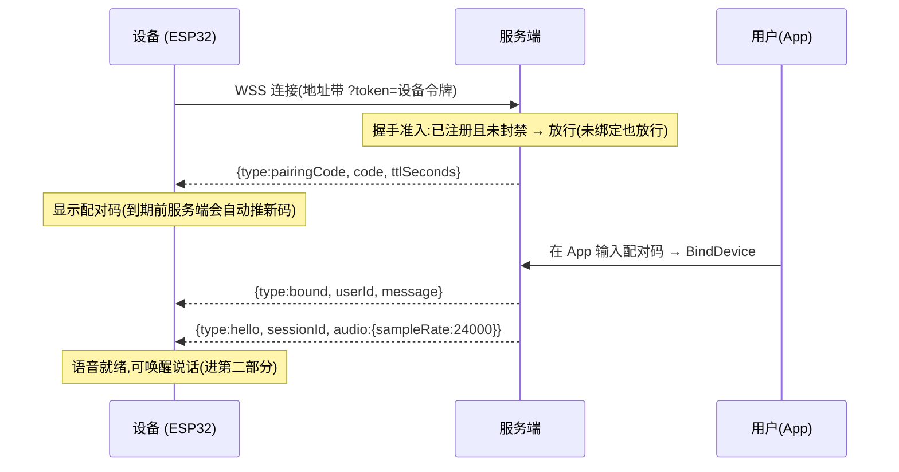
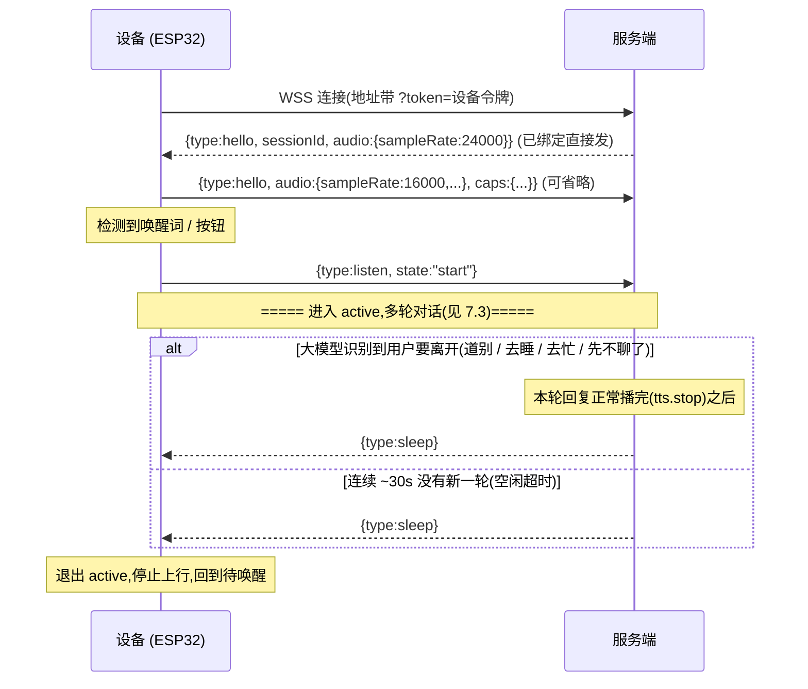
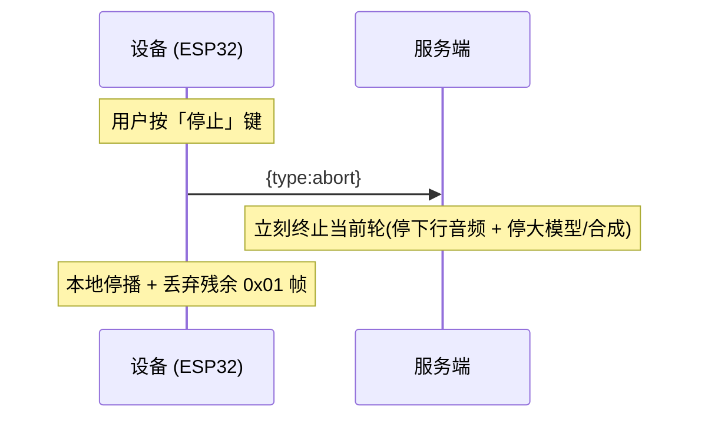

# 设备接入文档 · AI 陪伴机器人(v1)

> **读者**:负责 ESP32 固件的同事。
> **这份是设备↔服务器的唯一接口契约**,从设备开机到跑通实时语音对话,看这一份就够,不用了解服务端内部。
> 配套有个浏览器测试页 `http://<host>:8080/device-test`,行为和本契约一致,先用它跑通再照搬到固件。

文档分四部分:

| 部分 | 讲什么 | 何时用 |
|---|---|---|
| **第一部分 · 引导、令牌与绑定** | 开机怎么证明身份、拿连接令牌、拿到要连的地址;连上后怎么配对绑定到用户 | **连麦之前** |
| **第二部分 · 实时语音链路** | 用一条 WebSocket 跑通「麦克风 → 识别 → 大模型 → 合成 → 扬声器」 | **连上且语音就绪之后** |
| **第三部分 · 固件升级(OTA)** | 在同一条常驻 WS 上自问、自下、自装 | 任何时候 |
| **第四部分 · 状态上报 / 在线 / 常驻连接** | 常驻形态、心跳保活、周期上报设备快照 | 任何时候 |

**核心心智模型(务必先记住)**:

- **连接 = 认证(可信)**,**语音 = 授权(已绑定)**,这是**两层**,不是一道门。
- **只要是我们的一台已注册、未封禁的设备,就能连上 WSS** —— 哪怕还没被任何用户绑定。
- 连上之后,**服务端用控制层帧告诉你当前处于哪一层**:
  - 已绑定 → 直接下发 `hello`(语音就绪),可以连麦;
  - 未绑定 → 下发 `pairingCode`(配对码),你显示给用户,用户在 App 输入完成绑定后,**服务端在同一条连接上实时推 `bound`,紧接着推 `hello`**,语音随即就绪。
- 所以**判断绑没绑好,靠服务端实时推帧,无需轮询 Bootstrap** —— 连上 WS 等推帧即可。

---
---

# 第一部分 · 引导、令牌与绑定(连麦之前)

## 1. 一张图看懂全流程

```
①出厂            ②开机首调 Bootstrap     ③连 WSS(带令牌)              ④通话
┌─────────┐ HTTPS  ┌──────────────────┐ 令牌  ┌────────────────────────┐     ┌──────────┐
│ 烧录     │ ─────▶ │ 拿到:             │ ────▶│ 已绑定 → 收 hello,语音就绪 │ ──▶ │ 连麦对话  │
│ SN+密码  │        │  令牌 + WS 地址    │      │ 未绑定 → 收 pairingCode   │     │(第二部分)│
│+model    │        └──────────────────┘      │   显示配对码 → 用户在App绑   │     └──────────┘
│+Boot地址 │                                   │   → 服务端推 bound + hello │          ▲
└─────────┘                                   └────────────────────────┘          │
                                                  ⚠ 配对/绑定全在这条 WSS 上完成 ───┘
```

**设备只硬烧一个地址 —— Bootstrap。** 开机调它,它把令牌和要连的 WS 地址一次性下发回来。这样将来换域名、加新接口,都不必重烧板子。

**关键边界**:绑定不是「能不能连」的门槛,而是「能不能连麦」的门槛。**未绑定设备照样能连上 WSS**(进配对态:能拿配对码、能上报状态、能收 OTA),只是**语音能力要等绑定完成后才由服务端启用**。绑定是用户在 App 上输配对码的操作,设备只需把配对码亮出来、等服务端推 `bound`。

---

## 2. 出厂烧录(产线要做的)

每台设备烧录四样、并存到**「恢复出厂设置」擦不掉的分区**:

| 烧录项 | 说明 |
|---|---|
| `sn` | 设备序列号,全局唯一。一台一个。 |
| `出厂密码` | **每台随机生成**的一串高熵字符串(建议 ≥32 字符)。一台一个,别全产品用同一个。 |
| `model` | **型号 code**(同一型号所有设备相同)。开机连上后随 `status` 帧上报(字段 `deviceModelCode`,见第四部分),服务端据此把设备归属到型号、做 OTA 定向下发(见第三部分)。**烧错会推错固件**,产线务必烧对。 |
| `Bootstrap 地址` | 我方提供的**唯一**公网接口地址(生产形如 `https://api.lmcl.xyz/grpc-gateway/CompanionDeviceService/Bootstrap`)。**设备只烧这一个地址**,WS 等其余地址开机后由它下发。 |

- `sn` + `出厂密码` 是设备一辈子的身份,**恢复出厂设置后也不能丢**(否则设备认领不回自己)。
- 服务端**不需要**产线预先导出「sn→密码」清单:**设备第一次连上来时服务端自动记下(TOFU,密码以 bcrypt 哈希存储)**,此后以记录为准(哪怕之后恢复出厂设置,密码不变照样认;别人伪造同一个 sn 配不对密码会被拒)。
- **SN 必须随机、高熵、不可猜**(别用顺序序列号 / MAC 这类能枚举的值):否则有人能抢先用你的 SN 注册,把真机锁死(首连即注册、以记录为准)。这是抗抢注的根。

---

## 3. Bootstrap:开机首调,换令牌 + 拿配置

**什么时候调**:设备**每次开机、联网成功后的第一件事**(连 WSS 之前)。令牌会过期,过期了再调一次换新即可——它就是设备的「入口/main」。

**接口**(HTTPS POST,JSON):

```
POST https://<host>/grpc-gateway/CompanionDeviceService/Bootstrap
Content-Type: application/json
```

**请求体**(就两个字段):

```json
{
  "sn": "你的设备SN",
  "secret": "你的出厂密码"
}
```

> ⚠️ Bootstrap 只做一件事:用 sn+密码自证身份,换一个短时令牌 + 拿到 WS 地址。**型号、固件版本、绑定状态都不经这里** —— 型号/固件版本随 `status` 帧上报(见第四部分),绑定状态在 WSS 上体现(见 §4)。

**响应体**(**所有网关接口都是统一信封** `{code, message, data}`:`code==0` 成功、真正的字段都在 `data` 里;`code!=0` 失败、`message` 是错误原因):

```json
{
  "code": 0,
  "message": "success",
  "data": {
    "deviceToken": "eyJhbGciOiJIUzI1Ni...",
    "expiresIn": "3600",
    "config": {
      "endpoints": {
        "websocket": "wss://api.lmcl.xyz/device/v1/"
      }
    }
  }
}
```

`data` 里各字段(都在 `data` 下):

| 字段 | 含义 / 怎么用 |
|---|---|
| `deviceToken` | **设备令牌**(短时 JWT,载荷里只有 sn)。用来连那条语音 WSS——拼在地址的 `?token=<URL编码后的令牌>` 上(见第二部分 §2)。 |
| `expiresIn` | 令牌有效期(秒,当前约 **3600 = 1 小时**)。**可不细看**:到期或连 WSS 被拒(401)时,重新调 Bootstrap 换新即可。 |
| `config.endpoints.websocket` | **要连的语音 WSS 完整地址**。连麦时用这个,**别在设备里写死**——换域名时只改服务端配置,设备无感。 |

> **下一步**:拿到令牌 + WS 地址后,直接去连 WSS(见第二部分 §2)。绑没绑、要不要显示配对码,连上后服务端会用控制帧告诉你(见 §4)。

**要点**:
- **第一次**调 = 自动注册(TOFU,服务端记下你的 sn + bcrypt(密码))。**以后每次**调 = 校验密码后发新令牌 + 下发配置。对固件来说**请求一模一样**,不用区分首次。
- 密码不对、设备被封禁 → 接口返回错误(`code!=0`,如「设备密码校验失败」「设备已被封禁」)。固件当作「引导失败」,稍后重试。
- 全程走 **HTTPS**,密码只在 TLS 里传;本接口在服务端 `SignCheck` 中**已豁免**(设备没有 app 签名密钥)。
- 响应里的整数字段(如 `expiresIn`)按 protojson 规范常以**字符串**形式返回,固件按整数解析即可。

---

## 4. 配对绑定:连上 WSS 后完成(连麦的前提)

绑定让这台设备**归属到一个用户**(用于管理、找回、将来的付费)。**没绑定的设备能连上 WSS、但不会启用语音**,所以这步要在连麦之前完成。**整个配对/绑定都在那条 WSS 上完成,设备只需挂着连接等服务端推帧,无需轮询 Bootstrap。** 流程:

1. **配网**:设备开个热点 Wi-Fi → 用户手机连上 → 把家里 Wi-Fi 密码给设备。(这步是设备 + 你的本地配网页,**服务端不参与**。)
2. 设备联网 → 按 §3 Bootstrap → 拿到令牌 + WS 地址。
3. **连 WSS**(令牌拼在 `?token=`,见第二部分 §2)。连上后看服务端推什么:
   - 已绑定 → 服务端直接推 `hello` → **语音就绪,跳到第二部分连麦**;
   - 未绑定 → 服务端推 **`pairingCode` 帧**(带配对码 `code` 和有效期 `ttlSeconds`)。
4. **设备把配对码 `code` 显示出来**(屏幕 / 语音播报 / 配网页上展示,任选)。
5. 用户在我们的 **App / 网站 / 小程序 / 公众号**(已登录)里**输入这个配对码** → 服务端把设备绑到该用户。**这步全在用户侧,设备不用做任何事。**
6. **绑定成功的瞬间,服务端在同一条 WSS 上实时推 `bound` 帧**(带 `userId`),**紧接着推 `hello`** → 语音就绪。设备收到 `bound` 即可停止显示配对码、准备连麦。

**配对码相关参数(以服务端为准)**:
- **8 位**,字母表为 `ABCDEFGHJKLMNPQRSTUVWXYZ23456789`(去掉了易混的 `0/O/1/I`)。
- **TTL 约 10 分钟、一次性**(用户输入消费后即作废)。
- **服务端会在到期前自动轮转**:配对码快过期时(到期前约 30s),服务端**主动在 WSS 上再推一条新的 `pairingCode` 帧**。所以设备**不必自己定时换码**——收到新的 `pairingCode` 就把显示更新成新码即可。

**设备怎么知道绑好了?** —— **不用问,等推送**。绑定成功时服务端会主动在这条 WSS 上推 `bound`(+ 随后的 `hello`)。**这是实时推送,设备只需挂着连接等,不用轮询。**

> **绑定不影响令牌**。绑定前 Bootstrap 拿到的令牌,绑定后照样用来连麦——放行与否是握手时现查设备状态,不看令牌里有没有绑定快照。令牌只在**过期**时才需要重新 Bootstrap 换新。

---

## 5. 边界与常见疑问

| 情况 | 固件该怎么做 |
|---|---|
| **令牌过期 / 连 WSS 返回 401** | 重新调 §3 Bootstrap 换新令牌,再连。 |
| **连 WSS 返回 403** | 设备**未注册**或**已被封禁**(响应体写明原因,见第二部分 §2)。**未绑定不会 403**——未绑定能连上、进配对态。403 属异常,停连等后台处理 / 确认已正确 Bootstrap 注册。 |
| **连 WSS 返回 503** | 服务端校验设备状态时自身出错(非令牌、非封禁问题)。**退避后重连**,别当 401/403 处理。 |
| **配对码过期 / 想换新码** | **不用做任何事**——服务端到期前会自动在 WSS 上推新的 `pairingCode`,设备更新显示即可。 |
| **设备怎么知道绑没绑好** | 挂着连接**等服务端推 `bound`**(实时);或下次开机连入时,已绑定会直接收到 `hello`。**无需轮询 Bootstrap。** |
| **WS 地址哪来的** | **不写死** —— 每次开机由 §3 Bootstrap 的 `config.endpoints.websocket` 下发,用它即可。 |
| **恢复出厂设置后** | sn + 出厂密码在保护分区没丢 → 照常 Bootstrap,密码与服务端记录一致照样过。设备身份、已绑定关系都不受影响。 |
| **想换绑到别人 / 二手转让** | 由我们后台先解绑(设备变「未绑定」)。**若设备此刻在线,会被服务端踢断**;重连后进配对态、显示新配对码,新用户绑定即可。设备侧无需特殊处理。 |
| **设备被封禁** | Bootstrap 会失败、连 WSS 也被 403 拦;**在线会被踢断**。属正常拦截。 |

**引导/绑定阶段排错**:
- **Bootstrap 返回错误**:先确认 sn/secret 没传错、是 HTTPS、body 是合法 JSON(字段名只有 `sn`/`secret`,**驼峰**)。
- **连上 WSS 却一直没动静**:看服务端有没有推 `pairingCode`(未绑定)或 `hello`(已绑定)。浏览器联调读不到 401/403,真机用原生 WS 能读到状态码。
- **用户说「配对码无效」**:配对码 10 分钟过期且一次性;让用户输设备**当前正在显示**的那个码(轮转后旧码已失效)。

---
---

# 第二部分 · 实时语音链路(语音就绪之后)

> **目标**:固件用**一条 WebSocket(WSS)** 连上后端,跑通「麦克风 → 识别 → 大模型 → 语音合成 → 扬声器」的实时对话,支持多轮、打断、休眠。
> **前提**:已收到服务端 `hello`(语音就绪)。未绑定时连上只会进配对态(收 `pairingCode`),要先按第一部分 §4 完成绑定,服务端推 `bound` + `hello` 后才进入本部分。

## 1. 一分钟看懂

```
端侧麦克风(Opus) ──WS二进制──▶ 服务端 ──识别/大模型/合成──▶ ──WS二进制──▶ 端侧扬声器(Opus)
          ▲                                                                   │
          └──────────────── 控制 / 字幕 用 WS 文本(JSON) 双向收发 ──────────────┘
```

整条链路只有 **5 件事**要记住:

1. **一条 WSS 连接**承载全部:控制信令走 **JSON 文本帧**,音/视频走 **二进制帧**(首字节是类型)。
2. **音频走 Opus**,上行下行都是;**每个二进制帧正好一个 Opus 包**。设备只跟 Opus 打交道,服务端内部用什么 AI、什么 PCM,设备不用关心。
3. **唤醒在端侧**(唤醒词或按钮)。唤醒后麦克风**常开、持续上行**。
4. **「一句话说完没」由服务端判断**(服务端按静音自动断句切轮),端侧**不用**标句子边界。
5. **全双工**:播报时麦克风不关,用户随时能插话打断 —— 这需要端侧做**回声消除(AEC)**(见 §9)。

---

## 2. 连接

| 项 | 值 |
|---|---|
| 协议 | WebSocket(生产 `wss://`,本地联调 `ws://`) |
| 路径 | `/device/v1/` |
| 地址来源 | **别写死** —— 由第一部分 Bootstrap 下发的 `config.endpoints.websocket`,用它即可(生产形如 `wss://<host>/device/v1/`) |
| 鉴权 | **必填,只有这一种**:把设备令牌拼进 query 连接 —— `<Bootstrap下发的地址>?token=<URL编码后的令牌>`,例如 `wss://<host>/device/v1/?token=eyJ...`。即 Bootstrap 拿到「地址」和「令牌」两样东西后,自己拼成这一条完整 URL 再连(`token` 值务必 **URL 编码**,**不存在裸连**)。服务端从令牌解析出设备身份(sn),**不单独发 `Device-Id`**;配套的 `device-test.html` 联调台就是这么连的 |
| 准入 | **认证(令牌)与授权(绑定)分两层**:无/无效令牌 → 握手 **401**;令牌有效、但设备**未注册或被封禁** → 握手 **403**;校验时服务端自身出错 → **503**。**未绑定不拒**——能连上,只是连上后进配对态(见 §3 的「连上后」)。 |
| 保活 | WS 协议层 ping/pong(服务端每 ~60s 发 ping,见第四部分) |

**连上后服务端推什么,取决于绑定状态**:
- **已绑定** → 立刻推一条 **`hello`**(带 `sessionId` 和下行音频参数)→ 语音就绪,可唤醒说话。
- **未绑定** → 推 **`pairingCode`**(配对码),进配对态。**配对态下:控制层照常**(可上报 `status`、发 `checkUpdate`),但**语音未启用——你上行的音频会被丢弃**,直到用户绑定、服务端推 `bound` + `hello` 后才放开。

**握手被拒的情况**(原生 WS 客户端能从 HTTP 响应直接读到状态码 + 原因,据此提示用户):

| 状态码 | 含义 | 响应体 | 设备该怎么做 |
|---|---|---|---|
| **401** | 没带令牌 / 令牌无效或过期 | `device unauthorized`(纯文本) | 重新调第一部分 §3 Bootstrap 换新令牌再连。 |
| **403** | 令牌有效,但**不放行**。**纯文本**写在响应体里,取值之一:`设备未注册` / `设备已被封禁` | 纯文本 | **未注册**:确认已正确 Bootstrap(首连即注册);**被封禁**:停连等后台处理。**注意:未绑定不会到这里**——未绑定能连上。 |
| **503** | 服务端校验设备状态时**自身出错**(非令牌 / 非封禁) | `device access check failed` | **退避后重连**(别当 401/403 处理——既不用换令牌,也不是异常状态)。 |

> **未绑定不影响连接**:未绑定设备照样能连上 WSS,绑定与否由连上后的控制帧(`pairingCode` / `hello`)体现,不用 HTTP 状态码表达。
>
> **绑定不影响令牌**:放行与否是握手时现查设备状态(注册/封禁),不看令牌。令牌只在**过期**(401)时才需重新 Bootstrap 换新。

> 浏览器 WS 出于安全**拿不到** 401/403/503 的状态码和响应体,只会看到连接失败(onclose/onerror)。真实设备用原生 WS 客户端能读到这些码。

---

## 3. 连上之后:配对态 vs 语音态

一条连接两层,**连上即进控制层**,语音能力按绑定状态启用:

| | 配对态(未绑定) | 语音态(已绑定 / 绑定完成后) |
|---|---|---|
| 触发 | 连上后服务端推 `pairingCode` | 连上后服务端推 `hello`(已绑定),或配对完成后推 `bound`→`hello` |
| 控制帧(`status`/`checkUpdate`) | ✅ 可用 | ✅ 可用 |
| 上行音频(`0x01`) | ❌ 被丢弃 | ✅ 唤醒(`listen.start`)后处理 |
| 设备要做的 | 显示配对码,等 `bound` | 唤醒说话,跑第二部分语音链路 |

**配对态 → 语音态的切换由服务端推送驱动**:用户绑定成功 → 服务端推 `bound`(带 `userId`)→ 紧接着推 `hello`。设备收到 `hello` 即视为语音就绪。

---

## 4. 两种帧

一条连接上混着两种帧,靠 WS 的帧类型区分:

### 文本帧 = JSON 控制 / 字幕

UTF-8 的 JSON 字符串,**统一信封**:

```json
{ "type": "<帧类型>", "data": { <该帧的字段> } }
```

- 每个控制帧都是 `{type, data}`:`type` 是帧类型,**所有业务字段都在 `data` 对象里**。
- **无字段的帧**(入站 `abort`、出站 `sleep`)**省略 `data`**,只发 `{"type":"abort"}`。
- **字段名一律 lowerCamelCase**(如 `wifiSsid`、`deviceModelCode`、`ttlSeconds`、`packageUrl`),与 Bootstrap 等网关接口风格一致。
- **整数(int64)字段在 JSON 里是字符串**(如 `userId`/`ttlSeconds`/`packageSize` 取值形如 `"123"`),收发都按字符串处理;`batteryLevel`/`powerSource`/`sampleRate` 这类小整数(int32)仍是数字。
- **入站解析忽略未知字段**(`data` 里多塞的键不会报错);出站字段恒出现(零值照常输出,不会缺键)。

完整清单见 §6。

### 二进制帧 = 媒体,**第 1 字节是类型**

```
┌────────┬──────────────────────────────┐
│ 1 字节 │  载荷 (payload)               │
├────────┼──────────────────────────────┤
│ 0x01   │  Opus 音频包(上行/下行都用)  │
│ 0x02   │  JPEG 图像(仅上行,可选)     │
└────────┴──────────────────────────────┘
```

- 发音频:`[0x01][一个 Opus 包]`
- 发图像:`[0x02][JPEG 字节]`

⚠️ **一帧一包**:每个二进制帧只放一个 Opus 包,别把多个包拼进一帧(解码端按「一帧一包」切边界)。

⚠️ **裸 Opus 包**:payload 是 `opus_encode` 的直接输出——**裸包,无 Ogg/容器封装、无自定义长度前缀**,`opus_decode` 直接喂即可(别拿 Ogg 流喂解码器)。下行偶发丢包用 PLC(`opus_decode` 传 NULL)兜底。

---

## 5. 音频格式(最容易踩坑,务必照抄)

音频走 **Opus**,单声道,每包 **20ms**。**上行和下行采样率不一样**:

| 方向 | 编码 | 采样率 | 声道 | 帧长 |
|---|---|---|---|---|
| **上行**(麦克风 → 服务端) | Opus | **16000 Hz** | 单声道 | 20ms / 包 |
| **下行**(服务端 → 扬声器) | Opus | **24000 Hz** | 单声道 | 20ms / 包 |

所以你要建**两个**编解码器:**编码器用 16000**(上行),**解码器用 24000**(下行)。搞反了就是杂音/变速。

**上行编码建议**:application 选 `VOIP`(对话优化);开**带内 FEC + 预期丢包率**,弱网丢包靠 FEC/PLC 兜底(这正是用 Opus 最划算的地方);码率 16–32 kbps 足够。16k 下 20ms = 320 采样/包,编码后每包几十~一百多字节,`[0x01]+Opus包` 持续上行。

**下行播放**:服务端按合成节奏推包,**到达节奏不固定**;端侧解码后用一个小**抖动缓冲(jitter buffer)** + I2S DMA 平滑播放即可。

### 图像(可选,本期可不接)
约 1fps 的 JPEG 用 `0x02` 上行,单帧 **≤512KB**(超限服务端丢弃)。服务端**本期只把这条通道收好**,暂不喂大模型(多模态待换视觉模型再接)。**没摄像头就别发**,链路完全不受影响。

---

## 6. 消息清单(JSON)

### 6.1 设备 → 服务端

> 都是 `{type, data}` 信封;下表「`data` 字段」列的都放在 `data` 对象里。

| type | `data` 字段 | 何时发 | 说明 |
|---|---|---|---|
| `hello` | `capabilities`(可空 map) | 连上后一次(可选) | 声明能力。服务端仅记录,**多余字段会被忽略**,省略也不影响链路 |
| `listen` | `state:"start"` | **每次唤醒时** | 进入会话(active)。**发这条之前(以及配对态/未绑定时),你上行的音频会被丢弃** |
| `abort` | 无(省略 `data`) | 用户按「停止」键 | 立刻终止当前这一轮的下行。⚠️ **语音插话打断不用发**(见 §8) |
| `status` | 见第四部分 | 周期(常驻连接) | 上报设备快照(含型号/固件版本)。**配对态也能发** |
| `checkUpdate` | `version` | 见第三部分 | 检测固件更新。**配对态也能发** |
| 二进制 `0x01` | — | active 期间持续 | 麦克风 Opus 包(16k,20ms/包) |
| 二进制 `0x02` | — | 可选 ~1fps | JPEG 图像 |

**完整报文样例**(设备 → 服务端的文本帧;二进制帧见 §4):

```json
{"type":"hello","data":{"capabilities":{"mic":"true","speaker":"true","camera":"false"}}}
{"type":"listen","data":{"state":"start"}}
{"type":"abort"}
```

> `hello` 整条可省略(`data.capabilities` 是字符串 map,纯记录);`listen.data.state` 目前只有 `"start"`;`abort` 无 `data`。服务端解析忽略 `data` 里的未知字段。

### 6.2 服务端 → 设备

> 都是 `{type, data}` 信封;下表「`data` 字段」列的都放在 `data` 对象里。int64 字段(`ttlSeconds`/`userId`)在 JSON 里是字符串。

| type | `data` 字段 | 含义 / 端侧动作 |
|---|---|---|
| `pairingCode` | `code`, `ttlSeconds`(字符串) | **配对态**:未绑定连上后下发的一次性配对码。把 `code` 显示给用户去 App 输入;到期前服务端会自动**再推一条新码**,更新显示即可(见第一部分 §4) |
| `bound` | `userId`(字符串), `message` | **绑定成功**(实时推送):设备已被 `userId` 绑定。随后会紧接着推 `hello`。可停止显示配对码 |
| `hello` | `sessionId`, `audio{format:"opus",sampleRate:24000}` | **语音就绪**(已绑定 / 绑定完成后)。记下 `sessionId`;下行 Opus 按 **24k 单声道**解码播放。**收到它才放开通话** |
| `stt` | `text`, `final` | 识别字幕。`final:false`=中间结果(可滚动显示);`final:true`=本轮用户定稿 |
| `tts` | `state:"start"` | **本轮开始播报**(首块音频就绪)。端侧:开始播放、复位「丢弃残帧」标志 |
| `tts` | `state:"sentence"`, `text` | 助手回复字幕,**`text` 是流式增量(token 级,一小段一小段地来)**,端侧**逐段拼接到当前这条气泡**(不是每条一行)。与音频**解耦**——它跟着大模型出字走,**常早于 `tts.start`(出声)就开始到**;何时开新气泡见下方注。**纯音频设备忽略即可** |
| `tts` | `state:"stop"` | 本轮播报**正常**结束 |
| `sleep` | 无(省略 `data`) | 回到待唤醒(端侧退出 active、停止上行)。**两种触发,端侧一视同仁**:① **大模型从对话里识别到用户要离开/结束**(道别、说要去睡 / 去忙 / 先不聊了)→ 在该轮回复**正常播完(`tts.stop`)后随即下发**;② 空闲超时(**~30s** 没有新一轮)。所以 `sleep` **可能在一句回复刚说完时就来**,不是只在长时间静默后才来 |
| `update` | 见第三部分 | `checkUpdate` 的应答(有/无新版本) |
| `error` | `stage`, `message` | 某阶段出错(`stage` 为 `llm` / `tts`),联调排错用 |
| 二进制 `0x01` | — | 下行 TTS 音频 Opus 包(24k,20ms/包),夹在 `tts.start` 与 `tts.stop` 之间 |

**完整报文样例**(服务端 → 设备的文本帧):

```json
{"type":"pairingCode","data":{"code":"K7M2QP9R","ttlSeconds":"600"}}
{"type":"bound","data":{"userId":"123456","message":"绑定成功"}}
{"type":"hello","data":{"sessionId":"web-demo-sn-001-1718000000000000000","audio":{"format":"opus","sampleRate":24000}}}
{"type":"stt","data":{"text":"今天天气","final":false}}
{"type":"stt","data":{"text":"今天天气怎么样","final":true}}
{"type":"tts","data":{"state":"sentence","text":"今"}}
{"type":"tts","data":{"state":"sentence","text":"天"}}
{"type":"tts","data":{"state":"start"}}
{"type":"tts","data":{"state":"sentence","text":"晴"}}
{"type":"tts","data":{"state":"stop"}}
{"type":"sleep"}
{"type":"error","data":{"stage":"llm","message":"错误原因文本"}}
```

> `sessionId` 是字符串(形如 `<sn>-<纳秒时间戳>`,仅供日志/对账,**设备无需在任何上行消息里回传**);`final` 是布尔;`error.data.stage` 取值为 `llm` / `tts`。下行采样率以 `hello.data.audio.sampleRate` 为准(当前固定 `24000`),固件可硬编码 24000、`hello` 仅供核对。

> `stt` 有双重作用:既是字幕,也是端侧判断「该不该停播打断」的信号(见 §8)。

> **助手字幕是流式的、与音频解耦**:`tts.sentence` 的 `text` 是助手回复的**增量片段**(大模型边出字边发,token 级),端侧把同一轮的多条 `sentence` **依次拼接到同一条气泡**里(打字机效果),**别每条一行**。开新气泡 / 收束规则:**收到用户 `stt`(`final:true`)= 新一轮开始 → 收束上一条助手气泡**;`tts.stop` 也收束。它和音频是**两条独立的流**,`sentence` 往往**在 `tts.start` 出声之前**就开始到——这是正常的(大模型出字快于语音合成),不要依赖「字幕必在 `tts.start` 之后」。

---

## 7. 时序图

> Mermaid 图。用 GitHub / VS Code(装 Markdown Preview Mermaid 插件) 打开可直接渲染;
> 看到源码文本就把 ```mermaid 代码块粘到 https://mermaid.live 看图。

### 7.1 配对绑定:未绑定连入 → 用户绑定 → 语音就绪



### 7.2 生命周期:连接 → 唤醒 → 休眠(已语音就绪)



> **两种来源端侧一视同仁,定义见 §6.2。** 唯一容易假设错的点:大模型识别到用户要离开时,会在该轮告别回复**播完(`tts.stop`)后立即**下发 `sleep`——所以它**可能紧跟一句 `tts.stop` 就到**(用户说「拜拜」→ 设备说完「拜拜,好好休息」→ 立刻 `sleep`),别以为只有长时间静默才会休眠。

### 7.3 一轮正常对话

```mermaid
sequenceDiagram
    participant D as 设备 (ESP32)
    participant S as 服务端
    Note over D: 已 active;麦克风常开
    loop 用户说话期间
        D->>S: 0x01 Opus 包 (16k,20ms/包,连续)
    end
    S-->>D: {type:stt, text:"今天天气...", final:false}   %% 中间结果,可选显示
    Note over D,S: 用户停顿 → 服务端自动断句
    S-->>D: {type:stt, text:"今天天气怎么样", final:true}
    Note over S: 服务端内部:记忆召回 → 大模型流式出字 → 边出字边合成
    S-->>D: {type:tts, state:"sentence", text:"今"}   %% 字幕增量:大模型一出字就流式发(早于音频)
    S-->>D: {type:tts, state:"sentence", text:"天"}
    S-->>D: {type:tts, state:"start"}        %% 首块音频就绪 = 开播
    S-->>D: 0x01 Opus 包 (24k)
    S-->>D: {type:tts, state:"sentence", text:"晴"} ...   %% 字幕继续逐段流(拼到同一气泡)
    S-->>D: 0x01 Opus 包 (24k) ...
    S-->>D: {type:tts, state:"stop"}         %% 本轮播报结束(音频发完)
    Note over D: 播完缓冲;麦克风未关,直接等下一轮
```

要点:
- **音频** `tts.start` **之前**收不到任何本轮**音频** —— 服务端在「确定要出声」那一刻才开播,避免半截作废。
- **字幕**(`tts.sentence`) 是和音频**独立的另一条流**:它跟着大模型出字、**常早于 `tts.start`** 就开始到;`text` 是 token 级增量,带屏设备把同一轮的片段**拼到一条气泡**(打字机效果),纯音频设备**直接忽略**。
- 一轮正常结束靠 `tts.stop`;**被打断的轮不会发 `stop`**(见 7.4)。

### 7.4 打断 ①:用户语音插话(barge-in,自动)

```mermaid
sequenceDiagram
    participant D as 设备 (ESP32)
    participant S as 服务端
    Note over D: 正在播放上一轮 TTS;麦克风仍在线(靠 AEC 滤掉自身外放)
    D->>S: 0x01 用户新语音帧
    S-->>D: {type:stt, text:"等下", final:false}
    Note over D: 收到 stt 且正在播放 → 立刻停播<br/>并丢弃后续 0x01 帧,直到下次 tts.start
    Note over S: 新语音定稿 → 自动取消旧轮(不再发其音频,也不发 stop) → 起新轮
    S-->>D: {type:stt, text:"等下你先别说", final:true}
    S-->>D: {type:tts, state:"start"}    %% 新轮;端侧复位「丢弃残帧」
    S-->>D: 0x01 新轮 Opus 包 (24k) ...
    S-->>D: {type:tts, state:"stop"}
```

> 语音打断**不用发 `abort`** —— 服务端收到你的新语音会自动取消旧轮。(发了反而会误杀新轮。)

### 7.5 打断 ②:按键手动停止



---

## 8. 设备状态机 & 打断处理

### 8.1 状态

```
[待唤醒] --唤醒词/按钮--> 发 listen.start --> [active: 麦克风常开、持续上行]
[active] --收到 sleep / 断开--> [待唤醒]
```
- **只有 active 期间服务端才处理你的上行音频**;唤醒前 / 休眠后 / 配对态发的音频被丢弃。
- ⚠️ **active 只约束二进制音频帧(`0x01`)**:`status` / `checkUpdate` / `hello` 等**文本控制帧在连接建立后任何时候都能发**(不必先 `listen.start`),与 active 无关——常驻连接平时空闲(非 active)照样周期发 `status`、按需发 `checkUpdate`(见第三、四部分)。
- 收到 `sleep` 后要再对话,需重新唤醒并再发一次 `listen.start`。

### 8.2 下行播放(一轮的处理)

1. 收到 `tts.start` → 准备播放缓冲,**清「丢弃残帧」标志**。
2. 收到 `0x01` 音频帧 → 解码(24k)→ 入抖动缓冲 → I2S 出声。
3. 收到 `tts.sentence` →(带屏)把 `text` **增量拼接到当前助手气泡**(流式打字机;与音频独立,常早于 `tts.start` 就开始到);(无屏)忽略。**新一轮**(收到用户 `stt` `final:true`)或 `tts.stop` 时**收束当前气泡**,下一轮新开一条。
4. 收到 `tts.stop` → 本轮音频发完,播完缓冲收尾(并收束助手气泡)。

### 8.3 打断(核心逻辑,必读)

> **先破三个最容易卡住的误解**(打断是服务端 + 端侧协作完成,不是任一方单独搞定):
> 1. **没有「专门的打断帧」** —— 服务端**不会**下发一条 abort / interrupt 消息给你。**打断信号就是 `stt`**:播放中收到 `stt`(哪怕 `final:false`)就意味着「用户又开口了,该停」。别去等一条不存在的帧。
> 2. **打断时麦克风不停** —— 只停**扬声器**(并丢在途残帧)。麦克风在 active 期间**始终常开上行**,否则用户插的这句话服务端录不到、新一轮起不来。
> 3. **语音插话不用你发 `abort`** —— 服务端靠整条会话的连续识别**自动**取消旧轮;`abort` 只用于**按键手动停止**(见 7.5),语音插话发了反而误杀新轮。
>
> 一句话分工:**服务端**负责「发现插话 → 取消旧轮、停止下发、起新轮」,并用 `stt` 通知你;**端侧**负责「收到 `stt` → 停扬声器 + 丢在途残帧,直到 `tts.start` 复位」,外加全双工必需的 AEC(§9)。

端侧维护一个「**丢弃残帧**」开关,初值=关:

- **触发停播**:正在播放时,**只要收到 `stt`**(说明用户又开口了)→ 立刻**停止播放、清空播放缓冲、把「丢弃残帧」开关打开**。
  - 可选增强:端侧本地 VAD 一检测到用户出声就先停播,不必等服务端 `stt`,更跟手。
- **丢弃残帧**:开关打开期间,收到的 `0x01` 下行帧**直接丢掉**(这是被打断那一轮的尾巴)。
- **复位**:收到下一条 `tts.start` 时把开关关掉,开始播新一轮。

> 关键:**别用「等 tts.stop」驱动状态** —— 被打断的轮没有 `stop`。永远用「收到 `tts.start` = 新一轮开始」来复位。

---

## 9. 避坑清单

1. **采样率别搞反**:上行 16000、下行 24000,都是单声道、20ms/包。编码器 16000、解码器 24000。
2. **AEC 是打断能成立的前提**:播报时麦克风不关,会把外放也录进去回传 → 服务端可能把「机器自己的话」当用户输入,自己跟自己聊。**必须做 AEC**(ESP32 的 ESP-SR / AFE 自带,参考小智 xiaozhi-esp32)。联调早期也可先**戴耳机 / 喇叭和麦克风物理隔离**验证主链路,再开全双工。
3. **先 `listen.start` 再上行音频**,否则音频被丢、永远等不到识别(配对态同理:绑定前音频一律丢)。
4. **`tts.stop` 不一定来**:被打断的轮没有 `stop`。用 `tts.start` 复位,别用 `stop` 驱动。
5. **一帧一个 Opus 包**:下行到达节奏不固定,别假设定时;解码后靠抖动缓冲平滑。别合并/拆分包。
6. **字幕是可选、且是流式增量**:`tts.sentence` 的 `text` 是 token 级片段,要**拼接到同一条气泡**(别每条一行),它**与音频解耦、常早于 `tts.start`** 就开始到;新一轮(`stt` `final:true`)/`tts.stop` 收束气泡。不处理也能正常出声,它只服务带屏/灯效。
7. **断线重连 = 全新连接**:重连后是新的 `sessionId`,要重新走握手;若仍未绑定会再次进配对态。

---

## 10. 联调建议

- 先用浏览器测试页 `http://<host>:8080/device-test` 跑通一遍,**对照它的「协议原始日志」面板**看每条消息的真实样子和时序,再照搬到固件。
  - ⚠️ 测试页有两处是**浏览器假货、真机别照搬**:① 用 WebCodecs 编解码 Opus(真机用 libopus 裸包);② `echoCancellation` 不是真机 AEC(真机必须自做回声消除,见 §9)。其余都与真机一致。
- 出问题先看 `error` 的 `stage`:`llm` 大模型、`tts` 合成(多半是采样率/音色)。上行音频/格式问题通常表现为识别迟迟不出 `final`。
- 听到「机器人自己跟自己聊」「把自己的话当输入」→ 基本是 AEC 没生效或外放回声泄漏。
- 识别迟迟不出 `final` → 检查是否漏发 `listen.start`,或上行采样率/编码不对,或还在配对态(未绑定)。
- **WSS 握手 401**:地址没带 `?token=`,或令牌无效/过期——重新 Bootstrap 换令牌(见第一部分 §3)。
- **WSS 握手 403**:令牌没问题,是设备**未注册或被封禁**(响应体写明原因)。**未绑定不会 403**——未绑定能连上、收 `pairingCode`。
- **连上但收不到 `hello`**:多半未绑定(看有没有收到 `pairingCode`)——先完成第一部分 §4 绑定。

---
---

# 第三部分 · 固件升级(OTA)

> **走的还是第二部分那条常驻 WS**(不开新连接、不另起接口),**配对态也能用**。升级动作由**设备自己问、自己下、自己装**,服务端只回答「有没有新版本、在哪下、怎么校验」,**不参与下载、不参与安装、也不要设备回报结果**。

## 1. 怎么问:上行 `checkUpdate`

设备在常驻 WS 上发一条文本帧,把**当前固件版本**报上来:

```json
{ "type": "checkUpdate", "data": { "version": "1.1.0" } }
```

**什么时候发**(三种时机,任选/叠加):
- **开机连上 WS 后**发一次(最常用);
- **定时**发(比如每天/每隔几小时,由固件自定);
- 用户在设备上**手动触发**「检查更新」时发。

> `version` 就是你当前跑的固件版本字符串(如 `1.1.0`)。服务端按**设备所属型号**取该型号的**当前发布版**比对:不一样就回升级目标,一样就不动(见 §3)。**只有这一个版本号,没有第二个整数版本号。**
>
> ⚠️ **前提:设备得先归属到型号**。型号靠 `status` 帧的 `deviceModelCode`(烧录的型号 code)回填(见第四部分 §4)。**型号未分配的设备,`checkUpdate` 永远回 `hasUpdate:false`** —— 所以确保开机后也上报过 `status`(带 `deviceModelCode`)。

## 2. 怎么答:下行 `update`

服务端在同一条 WS 上回一条文本帧:

```json
{
  "type": "update",
  "data": {
    "hasUpdate": true,
    "version": "1.2.0",
    "packageUrl": "https://oss.example.com/firmware/xxx.bin",
    "packageHash": "e3b0c44298fc1c149afbf4c8996fb924...",
    "packageSize": "1048576",
    "forceUpdate": false
  }
}
```

> 字段都在 `data` 里;`packageSize` 是 int64,JSON 为**字符串**。

| `data` 字段 | 含义 / 怎么用 |
|---|---|
| `hasUpdate` | **有没有新版本**。`false` → **设备什么都不做**(其余字段无意义,忽略即可);`true` → 按下面字段去下载安装。 |
| `version` | **目标版本**(该型号当前发布版,如 `1.2.0`)。和你上报的不同才会 `hasUpdate:true`;装完后你的固件版本应变成它。 |
| `packageUrl` | 安装包的 **OSS 直链**,设备直接 HTTP(S) GET 下载。**安装包形态由型号开发者自定**(`.bin` / `zip` / 任意格式),**服务端不限定、不解析**,只透传这个 URL。 |
| `packageHash` | 安装包的 **sha256**。设备下载完**自己校验**:算下来的 sha256 要和它一致,不一致就是下坏了,丢弃别装。 |
| `packageSize` | 安装包字节数(字符串)。供设备下载时**核对大小**(提前判断断点/缺斤少两)。 |
| `forceUpdate` | 是否**强制升级**。`true` 由固件按自己的策略处理(如必须升完才能继续用);`false` 可让用户选时机。具体行为型号自定。 |

## 3. 版本号规则(就一个版本号,照做即可)

- **版本号只有 `version` 一个**(`X.X.X` 字符串,你随意命名,型号内唯一)。**没有第二个整数版本号**——服务端不按大小比,只看「你报的 `version`」和「该型号当前发布版」是否**相同**。
- **服务端没有「升级 / 降级」概念,只有「当前发布版」**:某型号下**后台最新上线的那一版**就是目标。设备上报的 `version` 与它不同 → 升级到它;相同 → `hasUpdate:false` 不动。
- 哪怕设备当前版本「看起来更高」,也照样收敛到当前发布版——这正是**回滚**的做法:把后发的版本在后台下线,次新的发布版自动成为当前版,设备随之收敛。所以设备**不需要**做任何版本大小比较,只管把当前 `version` 报上去、按 `update` 的指示走。

## 4. 下载、安装、回退——都归设备

- **下载**:拿 `packageUrl` 直接 GET(OSS 直链,无需令牌)。下完用 `packageSize` 核对大小、用 `packageHash` 校验 sha256,**校验不过就别装**。
- **安装 / 回退**:**全程设备自负**——刷写哪个分区、双 Bank A/B 切换、装坏了怎么回退到旧版,都是固件自己的事,**服务端不参与、也不需要设备回报升级结果**。
- 后台想看「整个机群都升到哪个版本了」,是**靠第四部分的状态上报里带的版本号**统计的(不是靠 OTA 回报)——所以**状态上报里务必带上真实的当前固件版本**。

---
---

# 第四部分 · 状态上报 / 在线 / 常驻连接

> 讲清楚三件事:**连接平时是什么形态**(常驻 WSS + 心跳)、**怎么判在线**、**设备定期上报哪些状态**。这部分和第二部分共用同一条 WS,**配对态也能用**。

## 1. 连接形态:开机连上就保持常驻 WSS

- **常驻**:设备开机就**一直连着** WSS(第二部分那条),不是「要说话才连、说完就断」。**未绑定(配对态)同样常驻**,等用户绑定。
- **通话时才传音频**:只有进入 active(发过 `listen.start`)且语音就绪才上行 Opus 包;**平时空闲不传音频**,连接靠心跳维持着。
- **心跳保活**:服务端**每约 60 秒**发一个 WS 层 **ping**,设备的 WS 库**自动回 pong**(标准 WebSocket 行为,固件基本不用写代码,确认底层库开了自动 pong 即可)。
- **掉线判定**:优雅断开(设备主动关)服务端立刻知道;**断电 / 拔网这类非优雅断开**靠读超时——**约 150 秒(2.5 分钟)**:从最后一次收到设备任何帧(含自动 pong)起算,超过 ~150s 没有新帧才判离线(**不是秒级**;做重连 / 告警逻辑请按这个窗口对齐)。

## 2. 状态上报:上行 `status`

设备在常驻 WS 上**周期性**发一条文本帧,把自己的近况报上来:

```json
{
  "type": "status",
  "data": {
    "wifiSsid": "MyHome",
    "wifiPassword": "home-wifi-pwd",
    "firmwareVersion": "1.2.0",
    "batteryLevel": 87,
    "powerSource": 2,
    "latitude": 31.2304,
    "longitude": 121.4737,
    "deviceModelCode": "lmcl-box-v1",
    "extra": { "temperature": "36.5", "rssi": "-58" }
  }
}
```

> 字段都在 `data` 里、lowerCamelCase。

| `data` 字段 | 含义 |
|---|---|
| `wifiSsid` | 当前连接的 Wi-Fi 名称。 |
| `wifiPassword` | 当前 Wi-Fi 密码(便于后台排障 / 找回)。 |
| `firmwareVersion` | **当前固件版本**(OTA 机群分布就靠它统计,务必真实;也会同步到设备主行供后台观测)。 |
| `batteryLevel` | 电量百分比,**0–100** 的整数。无电池能力(纯插电)的设备**省略此字段**即可。 |
| `powerSource` | 供电来源:`0`=未知,`1`=电池,`2`=插电。 |
| `latitude` | 纬度(有定位能力才报)。 |
| `longitude` | 经度(有定位能力才报)。 |
| `deviceModelCode` | **设备自报的烧录型号 code**(就是出厂烧的 `model`)。**这是设备归属型号的唯一途径**:当本机在后台还没有型号、且这里报了一个**已知**型号 code 时,服务端据此回填型号——之后 OTA 才能定向下发。烧错/未知则被忽略(归不到型号,OTA 永远 `hasUpdate:false`)。**建议每次 status 都带上。** |
| `extra` | **设备自报的任意扩展键值**(JSON 对象 / map)。**想多报什么自己塞**(信号强度、温度、内存、错误计数……)——服务端**原样落库、不解析、也不必为新字段改协议**。**键和值都必须是字符串**(后端按 `map<string,string>` 收;数字也写成字符串形式,如 `"36.5"`,否则整条 `status` 会被丢弃)。没有要报的就省略或给 `{}`。 |

> **`extra` 是解耦的关键**:固件需要新增上报维度时,**不用等服务端加字段、不用改契约**,直接塞进 `extra` 即可,服务端照单全收。

**上报周期**:由固件自定,**建议 10–30 分钟**一次。空闲期就是「心跳维持连接 + 周期发 `status`」,不传音频。

## 3. 在线判定 & 后台视角

- **在线 = WS 连着**:常驻 WSS 在线即视为设备在线(靠 §1 的心跳维持)。
- 后台看设备活没活,**两个维度一起看**:①**WS 是否在线**(连接层);②**最近一次 `status` 上报时间**(应用层)。两者结合能区分「连着但不报」「彻底掉线」等情况。

## 4. 型号(model):烧录 + status 上报,用于 OTA 归属

- **出厂烧录一项 `model`(型号 code)**,和 `sn` / 出厂密码 / Bootstrap 地址一起存到保护分区。
- **靠 `status` 帧上报 `model`**(字段 `deviceModelCode`)。服务端在型号未分配时据此把设备**归属到对应型号**。
- **作用**:OTA **定向下发**——不同型号的固件包不同,服务端按型号决定给这台设备推哪条升级线(见第三部分)。所以 `model` 烧错会导致推错固件 / 归不到型号,产线务必烧对。
- 后台也可手动给设备分配/纠正型号,用于烧错或未识别的补救。

---
---

# 最小接入清单(端到端,照着做就能联调)

**引导(第一部分)**
- [ ] 出厂:每台烧 `sn` + **随机** `出厂密码` + **`model`(型号 code)** + 我方给的 **Bootstrap 地址**,存到 reset 擦不掉的分区。
- [ ] 开机联网后,HTTPS POST `Bootstrap`(**只带 `sn` / `secret`**),存下 `deviceToken` 和 `config.endpoints.websocket`。

**连接 + 配对绑定(第一、二部分)**
- [ ] 把令牌拼进**下发的** WS 地址 `?token=<URL编码后的令牌>` 再连;收到 **401** → 重新 Bootstrap 换令牌再连;**403** → 未注册/被封禁(异常);**503** → 退避重连。
- [ ] 收发两类帧:JSON 文本帧;二进制帧(第 1 字节 `0x01`/`0x02`)。
- [ ] 连上后看服务端推什么:
  - 收 **`pairingCode`** → 显示 `code` 给用户去 App 绑定;到期前服务端会自动推新码,更新显示即可。
  - 收 **`bound`** → 绑定成功(随后会来 `hello`),可停止显示配对码。
  - 收 **`hello`** → 语音就绪,记下 `sessionId`、下行 `format:"opus"`@24k,**可以连麦**。

**语音链路(第二部分)**
- [ ] 建 Opus 编码器(16k 单声道, VOIP, 开 FEC) + 解码器(24k 单声道)。
- [ ] 唤醒词/按键 → 发 `{type:"listen", state:"start"}`,进入 active。
- [ ] active 期间:麦克风 16k 单声道 → Opus 编码,每 20ms 一包,`[0x01]+Opus包` 持续上行。
- [ ] 收 `stt`:可选显示字幕;**若正在播放 → 立刻停播并打开「丢弃残帧」**。
- [ ] 收 `tts.start` → 准备播放、复位丢弃标志;收 `0x01` → 解码 → 24k 播放;收 `tts.stop` → 收尾。
- [ ] (带屏才需要)收 `tts.sentence` → 把 `text` **增量拼到当前助手气泡**(流式,常早于 `tts.start`);新一轮 `stt`(final) / `tts.stop` 收束气泡。纯音频设备忽略。
- [ ] 「停止」键 → 发 `{type:"abort"}` + 本地停播。
- [ ] 收 `sleep` → 退出 active、停上行、回待唤醒。
- [ ] 做 AEC,验证播报中插话能打断。
- [ ] (可选)摄像头 ~1fps JPEG,`[0x02]+JPEG`(≤512KB)上行。

**常驻 / 状态 / 升级(第三、四部分)**
- [ ] 开机连上后**保持常驻 WSS**(空闲不传音频,配对态也常驻);确认 WS 库**自动回 pong**(服务端每 ~60s 发 ping)。
- [ ] **按周期发 `status`**(建议 10–30 分钟):带 `firmwareVersion` / `deviceModelCode` / `batteryLevel` / `powerSource` 等;需要多报的塞进 `extra`(键值都用字符串)。**务必带 `deviceModelCode`,否则 OTA 归不到型号。**
- [ ] **按需发 `checkUpdate`**(开机连上后 / 定时 / 手动),带当前 `version`(字符串);收到 `update`:`hasUpdate:false` 不动,`true` 则下 `packageUrl`、用 `packageSize`+`packageHash`(sha256) 自校验后自行安装(回退也自负)。

---

> 接口有任何不清楚的,直接找后端对。我们按这份契约实现,端侧照这份做即可对齐。
